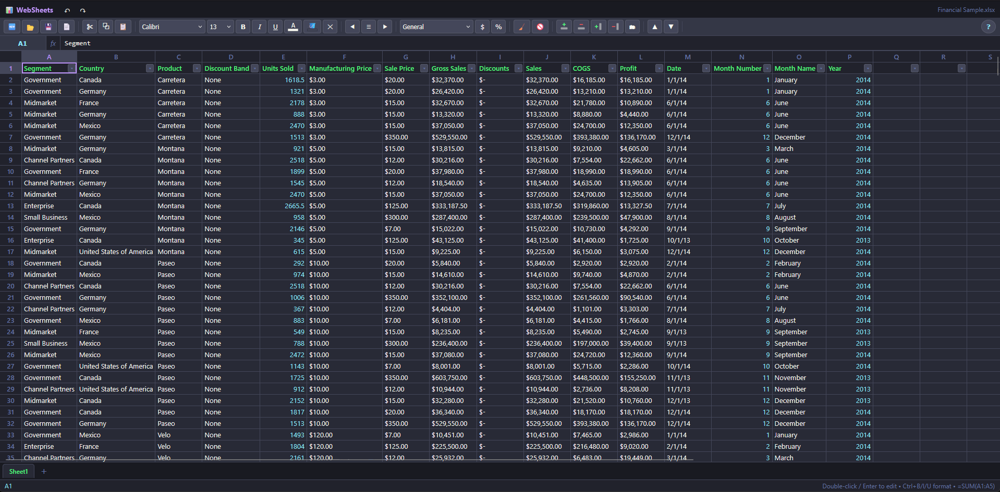

# MagikSheetz

A fast, self-contained spreadsheet application that runs entirely in your browser from a **single HTML file** — no build step, no server, no install. Open `index.html` and start working.



## Features

### Files
- **Open** `.xlsx`, `.xls`, and `.csv` files (via [SheetJS](https://sheetjs.com))
- **Save** the workbook as `.xlsx` (all sheets) or the current sheet as `.csv`
- Multi-sheet workbooks with tabs (add, rename, delete, and cycle between sheets)
- **Recent files** (Chrome/Edge only) — the File menu remembers files you've opened or saved and lets you reopen or re-save to them with one click, persisted across sessions. This needs the browser's File System Access API to get a reusable reference to a file, which Firefox and Safari don't implement; there, Open/Save fall back to the classic file picker/download with no recent-files list.

### Editing & formulas
- Click / double-click / `Enter` / `F2` or just start typing to edit a cell
- A **formula engine** supporting cell references (`A1`), ranges (`A1:B5`), arithmetic, comparisons, string concatenation, and functions:
  `SUM, AVERAGE, MIN, MAX, COUNT, COUNTA, PRODUCT, MEDIAN, STDEV, ROUND(UP/DOWN), ABS, SQRT, POWER, MOD, INT, IF, AND, OR, NOT, CONCAT, LEN, UPPER, LOWER, TRIM, LEFT, RIGHT, MID, COUNTIF, SUMIF, NOW, TODAY, PI`
- Circular-reference detection and error reporting (`#CIRC!`, `#ERROR!`, `#NUM!`)
- Copy / Cut / Paste — copying a formula and pasting **rewrites relative references** (A1 → B2…) like Excel, while `$`-locked parts stay fixed; tab-separated data still works to/from other apps
- Undo / Redo (up to 100 steps)

### Formatting
- Bold, italic, underline; font family & size
- **Font color** and **cell background color** pickers with a curated Dracula palette (dark tones tuned for readable row highlighting)
- Horizontal alignment
- **Number formats**: General, Number, Currency, Percent, Comma, Scientific, Date, Text — display-only, so the underlying values stay numeric for formulas
- Numeric-looking cells are auto-colored and right-aligned

### Data
- **Sort** any column ascending/descending (whole rows move together; the header row stays pinned), plus an **IP-address-aware sort** for columns of dotted IPv4 addresses (sorts numerically per octet, not as text)
- **AutoFilter** on the header row — per-column dropdowns with search, value checklists, and sort; paste a comma- or newline-separated list into the filter search box to bulk-select matching values, and repeated searches accumulate instead of replacing the previous selection
- Insert / delete rows and columns, including `Ctrl`+`Insert` / `Ctrl`+`Delete` to insert/delete the selected row(s) or column(s) without a confirmation prompt
- Resize rows and columns by dragging header edges
- **Fill handle** — drag the handle at the corner of the active cell to copy a value across cells or continue a detected series (e.g. `1, 2, 3…` or `Mon, Tue, Wed…`)
- Copying respects an active filter — only the currently visible (unfiltered) rows are copied, not hidden ones
- **Cross-sheet lookup / drill-down** — right-click a column to match its values against a column in another sheet; a **+** on each cell inline-expands the matching rows from that sheet
- **Export / import lookup mappings** — save the workbook's lookup configuration to a JSON file (by sheet + column header name) and re-apply it to a similar workbook
- **Convert units** — right-click a column → "Convert units…" to rewrite every numeric value in place between data-size units (B/KB/MB/GB/TB/PB, 1024-based) or data-rate units (bps/Kbps/…/Bps/KBps/…, 1000-based)

### PowerShell integration (optional)
MagikSheetz can talk to a small local **command server** (a PowerShell script in `server/`, see [server/README.md](server/README.md)) that runs commands on your machine and returns the results. It's entirely optional — the app works fully offline without it — and is gated behind a shared token plus an origin allow-list.
- **PowerShell command bar** — appears next to the formula bar once the server is detected; type a command and press `Enter` to run it on the server and drop the resulting objects into the current sheet as a table (overwriting it). `↑`/`↓` recall previous commands (persisted locally), and the dropdown arrow at the end of the bar lists command history to pick and rerun
- **Import AD users…** — query Active Directory (via the server) for a chosen set of user properties and import the results as a new sheet
- **Ping column…** — send every value in a column to the server to be pinged, writing reachability/latency either into a new column or overwriting an existing one
- **Command server settings** (⚙️ toolbar button) — configure the host, port, and auth token used to reach the server; a status indicator shows whether it's currently connected
- The server itself supports being reached from another machine on your network (`-BindAddress`) or from a copy of MagikSheetz hosted elsewhere like GitHub Pages (`-AllowedOrigins`) — see [server/README.md](server/README.md) for the security tradeoffs before enabling either

### UX
- **Frozen, auto-styled header row** and sticky column/row headers
- **Freeze columns** — right-click a column header → "Freeze columns (through X)" to pin the left columns while scrolling horizontally (independent of the frozen header row)
- **Virtualized grid** — only the visible rows are rendered, so sheets with tens of thousands of rows stay smooth
- Click-and-drag selection with edge auto-scroll; drag row/column headers to select whole rows/columns; click the top-left corner to select all cells
- Right-click **context menus** for cells, headers, and sheet tabs
- Toolbar actions are grouped into dropdowns (File, Clipboard, Alignment, Clear, Insert/delete, Sort, Lookup mappings, PowerShell actions) to keep the bar compact
- Dracula dark theme throughout
- A built-in **shortcuts help panel** (hover the `?` at the end of the toolbar), and an in-app version indicator

## Usage

Just open the file — that's it:

```
# clone, then open in your browser
git clone git@github.com:ultimal/magiksheetz.git
cd magiksheetz
# open index.html (double-click, or:)
start index.html      # Windows
open  index.html      # macOS
xdg-open index.html   # Linux
```

> Fully **offline** — the SheetJS library is bundled inside `index.html`, so no internet connection is required.

## Keyboard shortcuts

| Keys | Action |
|------|--------|
| Arrow keys | Move one cell |
| `Shift`+Arrows | Extend selection |
| `Tab` / `Shift`+`Tab` | Move right / left |
| `Ctrl`+`←` / `→` | Start / end of the current row |
| `Ctrl`+`↑` / `↓` | Top / bottom of the current column |
| `Ctrl`+`Home` / `End` | Go to A1 / last used cell |
| `Ctrl`+`Space` / `Shift`+`Space` | Select whole column / row |
| `Ctrl`+`A` / click top-left corner | Select all cells |
| `Enter` / `F2` / double-click | Edit the active cell |
| `Delete` / `Backspace` | Clear contents |
| `Ctrl`+`Insert` | Insert column left / row below the selection |
| `Ctrl`+`Delete` | Delete the selected row(s)/column(s), no confirmation |
| `Ctrl`+`C` / `X` / `V` | Copy / Cut / Paste |
| `Ctrl`+`B` / `I` / `U` | Bold / Italic / Underline |
| `Ctrl`+`Z` / `Ctrl`+`Y` | Undo / Redo |
| `Ctrl`+`.` / `Ctrl`+`,` | Next / previous sheet |

## Notes & limitations

- Visual styling (fonts, colors, number formats) is applied live in the app but is **not** written into exported `.xlsx`/`.csv` files with the free SheetJS build — exports contain the raw values. Persisting styles to files would require switching the save path to a library like ExcelJS.
- `.xlsx` files are fully loaded into memory (browsers can't stream a zip archive); the grid renders on demand via virtualization.
- The PowerShell command bar, AD user import, and ping column features require the optional local command server to be running and connected — the rest of the app works without it.
- Copying a very large selection (e.g. `Ctrl+A` on a big sheet) asks for confirmation first, since building and writing that much text can take a few seconds.

## Tech

- Plain HTML/CSS/JavaScript in one file — no framework, no bundler
- [SheetJS (xlsx)](https://sheetjs.com) bundled inline for spreadsheet file I/O (works offline)
- [Dracula](https://draculatheme.com) color palette
- Optional companion PowerShell command server (`server/magiksheetz-server.ps1`) for the PowerShell-backed features above
- In-app version indicator (`APP_VERSION` in `index.html`), bumped with each release

## License

[MIT](LICENSE) © ultimal
